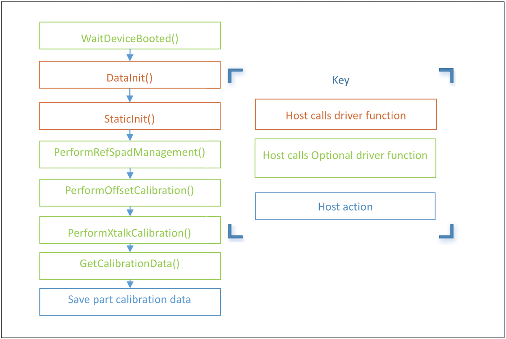
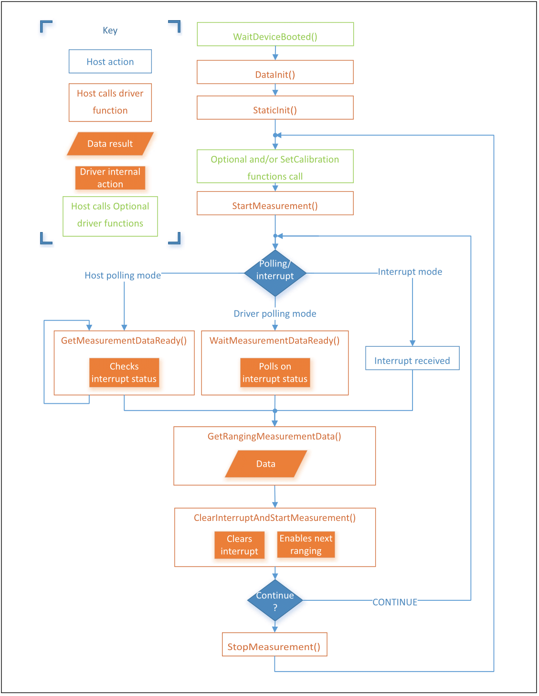

# VL53L1

Esse repositório contém uma biblioteca para lidar com o sensor de distância [VL53L1](https://www.st.com/en/imaging-and-photonics-solutions/vl53l1x.html) da ST.

Essa biblioteca foi feita para ser utilizada como submódulo no [STM32ProjectTemplate](https://github.com/ThundeRatz/STM32ProjectTemplate).

# Índice

- [Índice](#índice)
- [Utilizando a Biblioteca](#utilizando-a-biblioteca)
  - [Adicionando o Submódulo ao Projeto](#adicionando-o-submódulo-ao-projeto)
  - [Guia de Utilização](#guia-de-utilização)
    - [Exemplo de Adaptação da Biblioteca](#exemplo-de-adaptação-da-biblioteca-para-3-sensores-vl53l1)
- [Guia de Funcionamento da API](#guia-de-funcionamento-da-api)
  - [Sequências de Utilização](#sequências-de-utilização)

# Utilizando a Biblioteca

## Adicionando o Submódulo ao Projeto

Crie um diretório chamado `lib`, caso não exista:

```bash
mkdir lib
```
E adicione o submódulo fazendo:

* Com HTTPS:
```bash
git submodule add --name VL53L1 https://github.com/ThundeRatz/VL53L1.git lib/VL53L1
```

* Com SSH:
```bash
git submodule add --name VL53L1 git@github.com:ThundeRatz/VL53L1.git lib/VL53L1
```

## Guia de Utilização

Para utilizar a biblioteca, é necessário que, para cada sensor utlizado, sejam criadas as seguintes variáveis.

```C
VL53L1_Dev_t device;
VL53L1_RangingMeasurementData_t ranging_data;
VL53L1_CalibrationData_t calibration;
```

Cada sensor deve ser inciializado separadamente com a função:

```C
VL53L1_Error vl53l1_init(VL53L1_Dev_t* p_device, VL53L1_CalibrationData_t* calibration);
```

Quando utilizar mais de um sensor na mesma aplicação, é necessário desligar todos incialmente, e, individualmente, ligar, trocar o endereço de I2C e reiniciar cada um. Esse processo é feito com as funções abaixo, seguidas pela função de init.

```C
void vl53l1_turn_off(VL53L1_Dev_t* p_device);

void vl53l1_turn_on(VL53L1_Dev_t* p_device);

VL53L1_API VL53L1_Error VL53L1_SetDeviceAddress(VL53L1_DEV Dev, uint8_t DeviceAddress);
```

É importante que o usuário verifique o valor retornado por todas as funções acima. Valores diferentes de 0 indicam má inicialização de algum sensor, o que compromete a incialização dos subsequentes e pode causar um comportamento estranho em todas as leituras.

E finalmente, para atualizar a leitura do sensor, utiliza-se a função:

```C
uint8_t vl53l1_update_reading(VL53L1_Dev_t* p_device, VL53L1_RangingMeasurementData_t* p_ranging_data, uint16_t* p_reading,
                             uint16_t max_range);
```

Onde ```uint16_t* p_reading``` armazena o valor da leitura.

### Exemplo de adaptação da biblioteca para 3 sensores VL53L1.

Um projeto exemplo pode ser encontrado em [Berbardo/VL53L1_Example](https://github.com/Berbardo/VL53L1_Example), feito com base no [STM32ProjectTemplate](https://github.com/ThundeRatz/STM32ProjectTemplate).

# Guia de Funcionamento da API

Esta biblioteca utiliza a [API completa do VL53L1](https://www.st.com/en/embedded-software/stsw-img007.html) para adaptá-lo, que possui uma série de funções úteis para a utilização e modificação do sensor. A função dessa seção é familiarizar o usuário a essas funções para aproveitar o máximo dos sensores.

## Sequências de Utilização

O [Guia da API](docs/VL53L1X_API_User_Manual.pdf) nos fornece orientações quanto à sequência de utilização dos sensores, indicando a ordem que devemos chamar cada função de inicialização, calibração e mensuração dos sensores. Essas sequências estão presentes a seguir, e serão explicadas em detalhes na próxima seção.

### Sequência de Calibração



### Sequência de Mensuração



---------------------

Equipe ThundeRatz de Robótica
